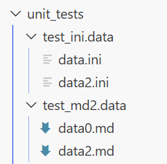
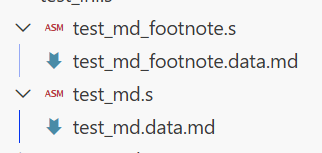

# riscv_asm_lib

A RISC-V assembler and linker library written in Rust, capable of parsing RISC-V assembly source text and producing ELF output for both executables and shared libraries.

This project used diagram-to-code idea and will need [Rust Macro Internal](https://github.com/NomoLynx/rust_macro_internal) to compile. If you want to view the diagram please install markdown and mermiad viewer in your IDE (e.g. VSCode)

---

## Features

- **PEG-based parser** — assembly source is parsed with [pest](https://pest.rs/) using the `r5asm.pest` grammar, giving precise, structured parse trees.
- **Full section model** — `.text`, `.data`, and `.rodata` sections are modelled and emitted into standard ELF sections.
- **ELF output** — produces RISC-V ELF files (executable or shared object).
- **Pseudo-instruction expansion** — high-level pseudo-instructions are expanded to real machine instructions during a second-round pass.
- **Compact (C-extension) optimisation** — optionally converts eligible instructions to the 16-bit compressed encoding.
- **Macro instructions** — user-defined macro instructions are stored in `CodeGenConfiguration` and expanded at assembly time.
- **Customized data sections** — `.data` section content can be defined in Markdown tables and ini file (`.data.md` files) using the `md_data` module.
- **Dynamic / shared-library support** — PLT stubs (plt0 / pltn) and ELF dynamic structures are generated for shared-library builds.
- **External symbol support** — symbols referenced but not defined in the current translation unit are forwarded as external relocations.
- **C-compatible library** — built as both `rlib` and `cdylib`, allowing the assembler to be called from C/C++ FFI.

---

## Supported RISC-V Extensions

The assembler supports the following extension families (instruction names are defined by `r5asm.pest` and resolved by the opcode table):

- **RV32I (base integer)**
    - Integer arithmetic, logic, branches, jumps, loads/stores, fence/system forms.
- **RV64I (and partial RV128-style forms used by this project)**
    - 64-bit integer load/store and W-suffixed arithmetic/shift operations.
- **RVC (C extension, compressed 16-bit)**
    - Compressed integer instructions and compressed floating load/store forms.
- **M extension**
    - Integer multiply/divide/remainder instructions (32-bit and 64-bit variants).
- **A extension**
    - Atomic instructions for word/doubleword forms (LR/SC and AMO families).
- **Zba (bit-manip address generation)**
    - Supported forms include `add.uw`, `sh1add`, `sh2add`, `sh3add`, `slli.uw`, and RV64 `*.uw` shift-add variants.
- **Zbb (bit-manip basic/core)**
    - Supported forms include `andn`, `orn`, `xnor`, `rol`, `ror`, `rori`, `clz`, `ctz`, `cpop`, `sext.b`, `sext.h`, `orc.b`, `rev8`, `zext.h`, `min`, `minu`, `max`, and `maxu`.
- **Zbs (bit-manip single-bit instructions)**
    - Supported forms include `bclr`, `bclri`, `bext`, `bexti`, `binv`, `binvi`, `bset`, and `bseti`.
- **F extension (single-precision floating point)**
    - Supported, including load/store (`FLW`/`FSW`), arithmetic (`FADD.S`, `FSUB.S`, `FMUL.S`, `FDIV.S`), comparisons, classify, move, and convert instructions.
- **D extension (double-precision floating point)**
    - Supported, including load/store (`FLD`/`FSD`), arithmetic (`FADD.D`, `FSUB.D`, `FMUL.D`, `FDIV.D`), comparisons, classify, move, and convert instructions.
- **Privileged/CSR instruction group**
    - CSR read/write forms and selected privileged/system operations.
- **Pseudo-instructions and project-specific TT extensions**
    - Expanded during assembly second-round processing.

### Floating-point Data Directives

- `.float` and `.double` directives are supported for data emission.
- Floating pseudo stack helpers are available (for example `pushf32`/`popf32` and `pushf64`/`popf64`).

### Notes

- This library accepts a practical subset used by the project and does not claim full ratified coverage of every optional RISC-V extension variant.
- Extension support is best validated by checking `src/r5asm/r5asm.pest` and `src/r5asm/opcode/opcode.rs` together.

---

## Crate Layout

```
riscv_asm_lib/
├── Cargo.toml
└── src/
    ├── lib.rs                  # crate root – re-exports r5asm module
    └── r5asm/
        ├── mod.rs              # module root; global flags OPTIMIZE_CODE_GEN / OPTIMIZE_TO_COMPACT_CODE
        ├── r5asm.pest          # PEG grammar for RISC-V assembly
        ├── r5asm_pest.rs       # generated pest types, Rule enum, helper functions
        ├── assembler.rs        # parse_asm() / parse_asm_use_default_config() entry points
        ├── asm_program.rs      # AsmProgram – top-level IR; owns Vec<Section>
        ├── asm_solution.rs     # ASMSolution – container for multi-file assembly projects
        ├── asm_error.rs        # AsmError enum and AsmErrorSourceFileLocation
        ├── code_gen_config.rs  # CodeGenConfiguration – drives the assembler/linker
        ├── linker_config.rs    # LinkerConfig – virtual address, library mode, soname
        ├── instruction.rs      # Instruction – single assembly instruction IR
        ├── r5inc.rs            # R5Inc – bit-packed machine-code word (derived from mermaid spec)
        ├── r5inc.mermaid       # bit-field layout diagram used to auto-generate R5Inc
        ├── machinecode.rs      # MachineCode helper
        ├── opcode/             # OpCode table (CSV-driven)
        ├── register.rs         # Register enum
        ├── imm.rs / imm_macro.rs  # Immediate value types and macros
        ├── directive.rs        # Assembly directives (.equ, .global, …)
        ├── section.rs          # Section – holds a list of SectionItems
        ├── elf_file/           # ELF file/header/code-section/data-section builders
        ├── elf_section/        # ELF section metadata (NoteSection, …)
        ├── label_offset/       # Label tables and offset resolution
        ├── external_label/     # External symbol tracking
        ├── dynamic_structure/  # PLT/GOT dynamic structures for shared libs
        ├── macro_instruction/  # Macro instruction definitions and archive
        ├── alignment/          # Alignment helpers
        ├── compact_inc.rs      # C-extension compact instruction conversion
        ├── build_snippet_parameters.rs
        ├── basic_instruction_extensions.rs
        ├── md_data.rs          # Markdown table → .data section converter
        └── traits/             # Shared traits (SectionSizeTrait, ToMarkdown, …)
```

---

## Dependencies

| Crate | Role |
|---|---|
| `core_utils` (internal) | Filesystem helpers, debug utilities, number utilities |
| `parser_lib` (internal) | Expression language (`ExprValue`, `ExprError`), Markdown parser |
| `rust_macro` (internal) | `#[derive(Accessors)]` and other proc-macros |
| `rust_macro_internal` (internal) | `#[packet_bit_vec]` proc-macro (drives `R5Inc`) |
| `pest` / `pest_derive` | PEG parsing framework |
| `libc` | C FFI types |
| `chrono` | Timestamp generation in generated files |

---

## Quick Start

### Parse assembly from a string

```rust
use riscv_asm_lib::r5asm::assembler::parse_asm_use_default_config;

let src = r#"
.text
.global _start
_start:
    addi a0, zero, 42
    ecall
"#;

let program = parse_asm_use_default_config(src).expect("assembly failed");
```

### Parse with custom configuration

```rust
use riscv_asm_lib::r5asm::{
    assembler::parse_asm,
    code_gen_config::CodeGenConfiguration,
};

let mut config = CodeGenConfiguration::default();
config.reset_replace_pseudo_code();   // expand pseudo-instructions
config.reset_generate_bin_and_code(); // emit machine code bytes

let program = parse_asm(src, &mut config).expect("assembly failed");
```

### Multi-file project (ASMSolution)

the asm file will support data file in .ini format under the <file_name> folder. Or the assembler support the <file_name>.md file at the same folder of .s file. Please see the images




---

## Key Types

### `AsmProgram`

The top-level intermediate representation produced by the parser. Contains a `Vec<Section>` and is responsible for:

- Label resolution across all sections.
- Second-round pseudo-instruction expansion (`second_round()`).
- ELF file generation.

### `CodeGenConfiguration`

Controls the entire assembly pipeline:

| Field | Default | Purpose |
|---|---|---|
| `replace_pseudo_code` | `true` | Expand pseudo-instructions to real instructions |
| `generate_bin_and_code` | `false` | Emit raw binary machine code |
| `build_target` | `0` | Target architecture variant |
| `linker_config` | `LinkerConfig::default()` | Linker settings |
| `note_section` | default | ELF `.note` section content |
| `marco_instruction_archive` | empty | User-defined macro instructions |
| `external_function_versions` | empty | Versioned external symbol table |

### `LinkerConfig`

| Field | Default | Purpose |
|---|---|---|
| `virutual_address_start` | `0x8100_0000` | Base virtual address for the executable |
| `is_build_lib` | `false` | Build as shared library instead of executable |
| `soname` | `None` | SONAME for the shared object |

### `AsmError`

Structured error type with source location (`file!()`, `line!()`):

```
AsmError::GeneralError(location, message)
AsmError::ParsingConversionError(location, message)
AsmError::NoFound(location, message)
AsmError::NotSupportedOperation(location, message)
AsmError::IOError
… (and more variants)
```

---

## Global Optimisation Flags

Two `static mut` flags can be set before calling the assembler to enable global optimisations:

```rust
// Enable general code-generation optimisations
unsafe { riscv_asm_lib::r5asm::OPTIMIZE_CODE_GEN = true; }

// Convert eligible instructions to 16-bit RISC-V C-extension encoding
unsafe { riscv_asm_lib::r5asm::OPTIMIZE_TO_COMPACT_CODE = true; }
```

> **Safety**: These flags are intended to be set once at program startup before any concurrent assembly work begins.

---

## Markdown Data Sections

Data section content can be described in Markdown tables inside a `.data.md` file placed alongside the assembly source. The `assembler::read_data_md()` function loads the file and converts the tables into a `.data` assembly block that is merged into the program.

```markdown
| label   | type | value |
|---------|------|-------|
| msg_len | word | 13    |
| msg_ptr | word | 0     |
```

---

## Data Files

| File | Purpose |
|---|---|
| `src/r5asm/opcode/opcode.csv` | RISC-V opcode encoding table |
| `src/r5asm/opcode/opcode_col.csv` | Opcode column metadata |
| `src/r5asm/r5inc.mermaid` | Bit-field layout that drives `R5Inc` code generation |
| `src/data/dynamic_plt0.s` | Template PLT stub (plt[0]) for dynamic linking |
| `src/data/dynamic_pltn.s` | Template PLT stub (plt[n]) for dynamic linking |

---

## License

See the repository root for license information.

